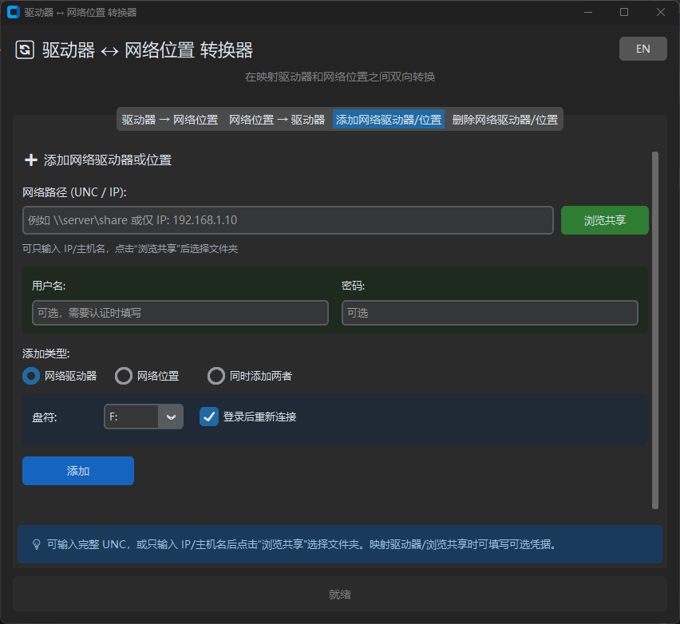

# Drive ↔ Network Location Converter

[中文](#中文说明) | [English](#english)

---

## 中文说明

### 简介

一个 Windows 工具，用于在**映射网络驱动器**和 **Windows 网络位置**之间进行双向转换，并支持直接添加 / 删除网络驱动器与网络位置。

适用于：局域网共享盘管理、UNC 路径整理、凭据清理，以及 Win11 下“能 Ping 通但无法访问共享”时的排查。

### 本次更新

- 新增 SMB 浏览身份排查与用户名/密码测试，可区分密码错误、共享无权限和 Guest 访问
- 支持查看、清理可枚举的 SMB 连接，并可按完整 UNC 路径清理隐藏的 1219 冲突连接
- 添加页面的路径预览支持复制；连续添加共享时保留用户名和密码（关闭软件后失效）
- 修复网络位置不显示、删除映射后残留红叉驱动器等问题

### 功能一览

| 功能 | 说明 |
| --- | --- |
| 驱动器 → 网络位置 | 将已映射网络驱动器转为网络位置快捷方式，并断开原盘符 |
| 网络位置 → 驱动器 | 将网络位置映射为驱动器（可选盘符），并删除原网络位置 |
| 添加网络驱动器 / 位置 | 支持完整 UNC，或仅 IP 后浏览共享再添加 |
| 删除网络驱动器 / 位置 | 断开驱动器 / 删除网络位置，可选同时删除凭据 |
| Windows 凭据管理器 | 从删除页直接打开当前用户的 Windows 凭据管理器 |
| 浏览共享 | 只知道 IP 时，枚举对方共享文件夹并点选 |
| 访问失败诊断 | 检测 Ping、SMB 445/139、凭据情况，给出具体原因与建议 |
| 多语言 | 中文 / 英文界面切换 |
| 兼容性 | Windows 7 / 10 / 11 |

### 截图



### 使用方法

#### 方式一：下载 EXE（推荐）

1. 从 [Releases](../../releases) 下载最新的 `DriveUNCConverter.exe`
2. 双击运行

#### 方式二：从源码运行

```bash
# 安装依赖
pip install -r requirements.txt

# 运行
python main.py
```

### 功能详解

#### 1. 驱动器 ↔ 网络位置

| 选项卡 | 作用 |
| --- | --- |
| 驱动器 → 网络位置 | 选择已映射驱动器，创建网络位置快捷方式，并断开该盘符 |
| 网络位置 → 驱动器 | 选择已有网络位置与可用盘符，映射为驱动器后删除该网络位置 |

操作前请确认没有程序正在占用对应路径中的文件。若驱动器被占用，程序会提示，可选择强制断开（可能导致未保存数据丢失）。

#### 2. 添加网络驱动器 / 位置

1. 打开 **添加网络驱动器/位置** 选项卡。
2. 在“网络路径”中输入：
   - 完整 UNC，例如 `\\192.168.1.10\资料`
   - 或仅 IP / 主机名，例如 `192.168.1.10`
3. **只知道 IP、不知道共享文件夹名时**：
   - 填写对方电脑的 **用户名** 和 **密码**（Win10/11 通常需要）
   - 点击 **浏览共享**
   - 在列表中点选目标共享
   - 可选勾选“显示隐藏共享 `$`”（如 `C$`、`ADMIN$` 等）
4. 选择添加类型：
   - **网络驱动器**：选择盘符，可选“登录后重新连接”
   - **网络位置**：可自定义名称，留空则自动生成
   - **同时添加两者**
5. 点击添加并确认。

说明：

- 账号密码主要用于**映射驱动器**和**浏览共享**
- 若路径错误、无权限或凭据冲突，失败对话框会展示具体原因（可复制）

#### 3. 删除网络驱动器 / 位置

1. 打开 **删除网络驱动器/位置** 选项卡。
2. 如需下次重新输入账号密码，勾选：
   - **同时删除相关凭据（下次需重新输入用户名和密码）**
3. 在列表中删除对应驱动器或网络位置。

**“同时删除凭据”做什么？**

- 会清理 Windows 凭据管理器中与该服务器相关的已保存账号
- 删除后，下次再添加同一服务器共享时，必须重新输入用户名和密码
- 适合账号变更、密码更新，或想清掉错误凭据的场景

#### 4. 访问失败诊断（常见于 Win11）

很多情况下主机 IP **可以 Ping 通**，但未输入账号密码时会提示“无法访问服务器”。这通常不是网络不通，而是认证 / 策略 / 端口问题。

程序会尽量给出：

| 项目 | 内容 |
| --- | --- |
| 原因判断 | 认证失败、路径错误、端口不可达、凭据冲突等 |
| 诊断信息 | Ping 结果、SMB 445 / 139 是否可达、是否提供了凭据、系统错误码 |
| 处理建议 | 补账号密码、浏览共享、断开旧连接、检查防火墙等 |
| 展示方式 | 可滚动详情窗口，支持一键复制 |

常见原因对照：

- **能 Ping 通但未登录**：共享要求身份验证（Win11 常见）
- **445 / 139 不通**：防火墙或服务未开放 SMB
- **错误码 1219**：同一服务器上已有其他账号连接（凭据冲突）
- **共享名错误**：可先用“浏览共享”确认实际共享文件夹名

### 编译打包

```bash
pip install pyinstaller
pyinstaller --onefile --windowed --name DriveUNCConverter main.py
```

也可以使用项目中的 `build.ps1` 进行打包。

编译后的 EXE 位于 `dist/DriveUNCConverter.exe`。

### 项目结构

```
DriveUNCConverter/
├── main.py           # GUI 主程序
├── drive_utils.py    # 核心逻辑（转换 / 添加 / 删除 / 浏览共享 / 诊断）
├── requirements.txt  # 依赖列表
├── build.ps1         # 可选打包脚本
├── assets/           # 截图等资源
└── README.md         # 说明文档
```

### 注意事项

- 转换、断开或删除前，请确保没有正在使用相关驱动器 / 网络位置的文件
- 驱动器占用时会提示，可选择强制断开（可能导致未保存数据丢失）
- 仅输入 IP 浏览共享时，Win10/11 多数环境需要先填写正确账号密码
- “同时删除凭据”会清理该服务器相关的 Windows 已保存凭据，请确认后再勾选
- 若已有其他账号连接同一服务器，可能出现凭据冲突；可先删除旧连接 / 凭据后再重试

---

## English

### Introduction

A Windows utility for bidirectional conversion between **mapped network drives** and **Windows Network Locations**, with direct add / remove support.

Useful for managing LAN shares, organizing UNC paths, clearing credentials, and diagnosing the common Windows 11 case where Ping works but share access fails without credentials.

### Latest Updates

- Added SMB browse-identity diagnostics and credential testing to distinguish invalid passwords, share permission failures, and Guest access
- Added a list of clearable SMB connections, plus exact-UNC cleanup for hidden error 1219 conflicts
- UNC path previews are copyable; username and password remain available for consecutive additions until the app closes
- Fixed missing Network Locations and stale disconnected drives shown with a red X

### Features

| Feature | Description |
| --- | --- |
| Drive → Network Location | Convert a mapped drive into a Network Location shortcut and disconnect it |
| Network Location → Drive | Map a free drive letter and remove the Network Location |
| Add drive / location | Full UNC, or IP-only + Browse Shares |
| Remove drive / location | Disconnect drive / delete location; optional credential cleanup |
| Windows Credential Manager | Open the current user's Credential Manager from the Remove tab |
| Browse Shares | Enumerate remote shares when only an IP/hostname is known |
| Access diagnostics | Check Ping, SMB 445/139, credentials, and show concrete reasons |
| Multi-language | Chinese / English UI |
| Compatibility | Windows 7 / 10 / 11 |

### Usage

#### Option 1: Download EXE (Recommended)

1. Download the latest `DriveUNCConverter.exe` from [Releases](../../releases)
2. Double-click to run

#### Option 2: Run from Source

```bash
# Install dependencies
pip install -r requirements.txt

# Run
python main.py
```

### Feature Details

#### 1. Drive ↔ Network Location

| Tab | What it does |
| --- | --- |
| Drive → Network Location | Creates a Network Location shortcut and disconnects the selected drive |
| Network Location → Drive | Maps a free drive letter and removes the selected Network Location |

Close open files on the target path before converting. If the drive is busy, you can force-disconnect (may lose unsaved data).

#### 2. Add Network Drive / Location

1. Open the **Add** tab.
2. Enter either:
   - a full UNC path, e.g. `\\192.168.1.10\share`
   - or only an IP/hostname, e.g. `192.168.1.10`
3. If you only know the IP:
   - fill in the remote **username** and **password** (usually required on Win10/11)
   - click **Browse Shares**
   - select the target share
   - optionally show hidden `$` shares
4. Choose mode:
   - **Network drive** (drive letter + optional reconnect)
   - **Network location** (optional custom name)
   - **Both**
5. Confirm to apply.

Notes:

- Credentials are mainly used for **drive mapping** and **share browsing**
- On failure, a detailed dialog explains the reason (copy supported)

#### 3. Remove Network Drive / Location

1. Open the **Remove** tab.
2. Optionally enable:
   - **Also delete related credentials (re-enter username/password next time)**
3. Remove the drive or location from the list.

**What “Also delete credentials” does**

- Clears saved Windows Credential Manager entries for that server
- Next time you add a share on the same server, username/password must be entered again
- Useful after password changes or bad cached credentials

#### 4. Failure Diagnostics (Common on Win11)

It is common for an IP to respond to Ping while share access fails without credentials. This is usually authentication, policy, or port related—not “network down”.

The app reports:

| Item | Content |
| --- | --- |
| Reason | Auth failure, bad path, port unreachable, credential conflict, etc. |
| Diagnostics | Ping, SMB 445/139 reachability, whether credentials were provided, Win32 error |
| Suggestions | Enter credentials, browse shares, drop old connections, check firewall |
| UI | Scrollable detail dialog with copy support |

Typical cases:

- **Ping OK, no login**: authentication required (common on Win11)
- **445 / 139 closed**: firewall or SMB service issue
- **Error 1219**: another account is already connected to the same server
- **Wrong share name**: use **Browse Shares** to discover real share names

### Build

```bash
pip install pyinstaller
pyinstaller --onefile --windowed --name DriveUNCConverter main.py
```

You can also use `build.ps1` if present.

The compiled EXE will be in `dist/DriveUNCConverter.exe`.

### Project Layout

```
DriveUNCConverter/
├── main.py           # GUI
├── drive_utils.py    # Core logic (convert / add / remove / browse / diagnose)
├── requirements.txt
├── build.ps1         # Optional packaging script
├── assets/
└── README.md
```

### Caution

- Ensure no files are in use before converting, disconnecting, or deleting
- Force disconnect is available when a drive is busy (may lose unsaved data)
- Browsing shares by IP alone usually requires credentials on Windows 10/11
- “Also delete credentials” clears saved Windows credentials for that server
- Credential conflicts can occur if another account already has a session to the same server

---

## License

MIT License
